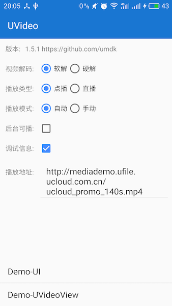
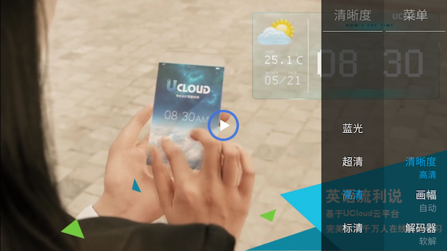
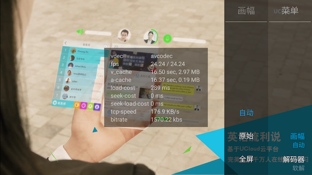

# 多媒体播放器 SDK 文档

UCDMediaPlayer SDK 是一款支持直播、点播播放器。

  
  
  

## 功能特性

- 基于 [ijkplayer][1]
- 支持 RTMP、HLS、HTTP-FLV、RTSP 等协议
- 支持直播、点播播放
- 支持软解、硬解切换
- 支持画幅调整
- 支持全屏、非全屏切换
- 支持屏幕亮度调节
- 支持音量调节
- 支持播放进度拖拉操作
- 支持 arm、armv7a、arm64-v8a、x86 等主流芯片体系架构
- 支持 Android 2.3 以上

## 版本要求

Android 2.3+ (API 9+)

## 下载Apk，体验直播功能

  

## 使用方法

请参考 wiki 文档：[UCDMediaPlayer 开发指南][2]

## 版本历史

请参考 wiki 文档：[版本历史][6]

## 常见问题

详细请见 [UCDMediaPlayer 常见问题][5]

## 反馈和建议

UMediaPlayer 目前基于 [ijkplayer][1] , 感谢 [ijkplayer][1].

  - 请尽量在 [github issue][3] 上公开讨论技术问题，私下邮件询问恕不一一回复

### 问题反馈参考模板

|名称|描述|
|---|---|
|设备型号|华为 Mate 8|
|系统版本|Android 5.0|
|SDK 版本|v1.4.1|
|问题描述|描述问题现象|
|操作路径|重现问题的操作步骤|
|附件|播放界面截屏、报错日志截图等|

[1]: https://github.com/Bilibili/ijkplayer
[2]: https://github.com/umdk/UCDMediaPlayer_Android/wiki
[3]: https://github.com/umdk/UCDMediaPlayer_Android/issues
[5]: https://github.com/umdk/UCDMediaPlayer_Android/wiki/6-常见问题#6
[6]: https://github.com/umdk/UCDMediaPlayer_Android/wiki/8-版本历史#8
